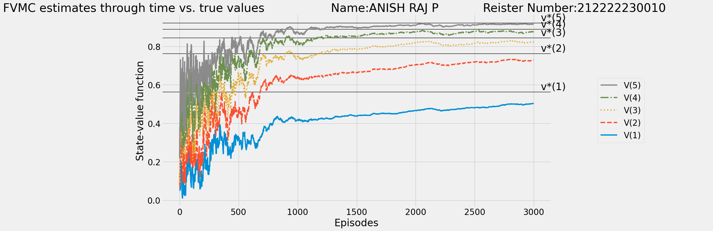

# SARSA Learning Algorithm


## AIM


## PROBLEM STATEMENT
Explain the problem statement.

## SARSA LEARNING ALGORITHM
Include the steps involved in the SARSA Learning algorithm

## SARSA LEARNING FUNCTION
### Name: Anish Raj P
### Register Number: 212222230010
```
def sarsa(env,
          gamma=1.0,
          init_alpha=0.5,
          min_alpha=0.01,
          alpha_decay_ratio=0.5,
          init_epsilon=1.0,
          min_epsilon=0.1,
          epsilon_decay_ratio=0.9,
          n_episodes=3000):
    nS, nA = env.observation_space.n, env.action_space.n
    pi_track = []
    Q = np.zeros((nS, nA), dtype=np.float64)
    Q_track = np.zeros((n_episodes, nS, nA), dtype=np.float64)
    # Write your code here
    select_action = lambda state, Q, epsilon:np.argmax(Q[state]) if np.random.random() > epsilon else np.random.randint(len(Q[state]))
    alphas = decay_schedule(init_alpha, min_alpha,
                            alpha_decay_ratio, n_episodes)
    epsilons = decay_schedule(init_epsilon, min_epsilon,
                              epsilon_decay_ratio, n_episodes)
    for e in tqdm(range(n_episodes), leave=False):
      state, done = env.reset(), False
      action = select_action(state, Q, epsilons[e])
      while not done:
        next_state, reward, done, _= env.step(action)
        next_action = select_action(next_state, Q, epsilons[e])
        td_target = reward + gamma * Q[next_state][next_action] * (not done)
        td_error = td_target - Q[state][action]
        Q[state][action] = Q[state][action] + alphas[e] * td_error
        state, action = next_state, next_action
      Q_track[e] = Q
      pi_track.append(np.argmax(Q, axis=1))
    V = np.max(Q, axis=1)
    pi = lambda s: {s:a for s, a in enumerate(np.argmax(Q, axis=1))}[s]
    return Q, V, pi, Q_track, pi_track

Q_sarsas, V_sarsas, Q_track_sarsas = [], [], []
for seed in tqdm(SEEDS, desc='All seeds', leave=True):
    random.seed(seed); np.random.seed(seed) ; env.seed(seed)
    Q_sarsa, V_sarsa, pi_sarsa, Q_track_sarsa, pi_track_sarsa = sarsa(env, gamma=gamma, n_episodes=n_episodes)
    Q_sarsas.append(Q_sarsa) ; V_sarsas.append(V_sarsa) ; Q_track_sarsas.append(Q_track_sarsa)
Q_sarsa = np.mean(Q_sarsas, axis=0)
V_sarsa = np.mean(V_sarsas, axis=0)
Q_track_sarsa = np.mean(Q_track_sarsas, axis=0)
del Q_sarsas ; del V_sarsas ; del Q_track_sarsas
```

## OUTPUT:

### Optimal policy, optimal value function , success rate for the optimal policy.


### State value functions of Monte Carlo method:


### State value functions of SARSA learning:


## RESULT:
Thus, SARSA learning successfully trained an agent for optimal policy.
